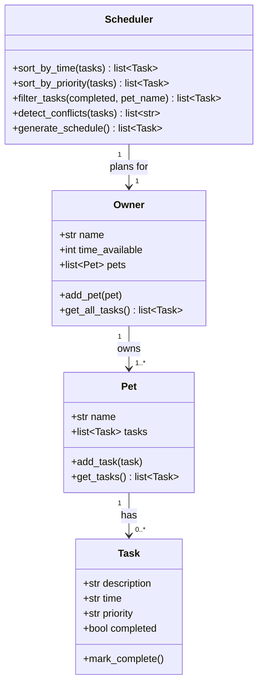

# PawPal+ (Module 2 Project)

You are building **PawPal+**, a Streamlit app that helps a pet owner plan care tasks for their pet.

## Scenario

A busy pet owner needs help staying consistent with pet care. They want an assistant that can:

- Track pet care tasks (walks, feeding, meds, enrichment, grooming, etc.)
- Consider constraints (time available, priority, owner preferences)
- Produce a daily plan and explain why it chose that plan

Your job is to design the system first (UML), then implement the logic in Python, then connect it to the Streamlit UI.

## What you will build

Your final app should:

- Let a user enter basic owner + pet info
- Let a user add/edit tasks (duration + priority at minimum)
- Generate a daily schedule/plan based on constraints and priorities
- Display the plan clearly (and ideally explain the reasoning)
- Include tests for the most important scheduling behaviors

## ✨ Features

PawPal+ is built around a small set of scheduling algorithms in [`pawpal_system.py`](pawpal_system.py). Each one is exercised in [`main.py`](main.py) and covered by the test suite.

- **⏱️ Sorting by time of day** — `Scheduler.sort_by_time()` orders tasks earliest→latest by their `"HH:MM"` time. It sorts on a numeric `(hour, minute)` key rather than the raw string, so an unpadded `"9:00"` correctly comes before `"10:00"`. It returns a new list (never mutating the input) and defaults to all of the owner's tasks.
- **⭐ Priority-based scheduling** — `Scheduler.sort_by_priority()` goes beyond simple time sorting: it orders tasks by **priority first** (High → Medium → Low, unknown labels last) and then **by time of day within each priority level**. The sort key is `(-priority_rank, (hour, minute))`, so the most important tasks always float to the top while staying chronological among equals.
- **🔎 Filtering** — `Scheduler.filter_tasks()` narrows tasks by **pet name**, **completion status**, or both (combined with AND). Called with no arguments it returns every task across every pet, so it composes cleanly with sorting: `sort_by_time(filter_tasks(pet_name="Buddy"))`.
- **⚠️ Conflict warnings** — `Scheduler.detect_conflicts()` flags any two tasks whose `[start, start + duration)` time windows overlap — both exact same-time clashes and partial overlaps, within one pet or across pets. It returns human-readable warning strings (never raises), skips unparseable times instead of crashing, and sorts + short-circuits so it runs closer to O(n log n) than a naive O(n²) all-pairs check.
- **🕳️ Next available slot** — `Scheduler.find_next_available_slot(duration)` goes beyond *reporting* clashes to *proposing* a fix: it scans the day for the earliest open gap (optionally bounded by `earliest`/`latest`) large enough to fit a task of the given duration without overlapping existing commitments. It uses a greedy left-to-right interval scan over sorted busy windows (O(n log n)), ignores completed tasks, and returns `None` when no gap fits.
- **🔁 Daily recurrence** — completing a `"daily"` or `"weekly"` task via `Task.mark_complete()` automatically queues a fresh, incomplete copy for the next occurrence (built by `Task._next_occurrence()`). Completing an already-done task is a no-op, so duplicates never spawn; one-off tasks do not regenerate.
- **⭐ Priority planning** — `Scheduler.prioritize_tasks()` ranks unfinished tasks High→Medium→Low (unknown labels rank last), and `Scheduler.generate_schedule()` greedily selects them until the owner's available time runs out.
- **💬 Explainable schedule** — `generate_schedule()` records a reason for every task it picks or skips, surfaced by `Scheduler.explain_plan()`, so the plan is never a black box.

## Getting started

### Setup

```bash
python -m venv .venv
source .venv/bin/activate  # Windows: .venv\Scripts\activate
pip install -r requirements.txt
```

### Run it

```bash
# 1. Run the command-line demo (creates an owner, pets, and tasks, then
#    sorts / filters / detects conflicts / builds a schedule):
python main.py

# 2. Launch the interactive Streamlit app:
streamlit run app.py

# 3. Run the test suite:
python -m pytest
```

### Suggested workflow

1. Read the scenario carefully and identify requirements and edge cases.
2. Draft a UML diagram (classes, attributes, methods, relationships).
3. Convert UML into Python class stubs (no logic yet).
4. Implement scheduling logic in small increments.
5. Add tests to verify key behaviors.
6. Connect your logic to the Streamlit UI in `app.py`.
7. Refine UML so it matches what you actually built.

## 🏛️ Architecture & Classes

PawPal+ follows a simple object-oriented design with four classes in
[`pawpal_system.py`](pawpal_system.py). The UML lives in
[`diagrams/uml_final.mmd`](diagrams/uml_final.mmd) (Mermaid source).

- **`Task`** — a single pet-care activity. Holds `description`, `duration`, `frequency`, `priority`, `time` (`"HH:MM"`), and a `completed` flag, plus a `pet` back-reference. Key method: `mark_complete()` (which also regenerates recurring tasks). Supports `edit_task()` and JSON `to_dict()`/`from_dict()`.
- **`Pet`** — a pet (`name`, `species`, `age`) that **owns a collection of `Task`s**. Methods: `add_task()`, `remove_task()`, `get_tasks()`, plus serialization.
- **`Owner`** — the user (`name`, `time_available`, `preferences`) that **owns a list of `Pet`s**. Methods: `add_pet()`, `get_all_tasks()` (flattens tasks across *every* pet), `update_preferences()`, and `save_to_json()`/`load_from_json()` for persistence.
- **`Scheduler`** — the brains. Given an `Owner`, it retrieves and organizes tasks **across all pets** and provides the algorithmic features: `sort_by_time()`, `sort_by_priority()`, `filter_tasks()`, `detect_conflicts()`, `find_next_available_slot()`, and `generate_schedule()` (+ `explain_plan()`).

**Relationships:** `Owner 1 → * Pet`, `Pet 1 → * Task` (with a `Task → Pet` back-reference), and `Scheduler → Owner` (reads it to plan across all pets).



## 🧪 Testing PawPal+

Run the full test suite from the project root:

```bash
python -m pytest
```

The suite (in [`tests/test_pawpal.py`](tests/test_pawpal.py)) has **26 tests** covering the core scheduling behaviors:

- **Task & pet basics** — marking a task complete flips its status; adding a task grows the pet's task list.
- **Recurrence logic** — completing a `daily`/`weekly` task auto-queues a fresh, incomplete copy for the next day; completing twice never spawns duplicates; one-off tasks do not regenerate.
- **Sorting correctness** — `sort_by_time()` and `sort_by_priority()` return tasks in the right order, sort numerically so `"9:00"` precedes `"10:00"`, place unparseable times last without crashing, and don't mutate the input list.
- **Priority-based scheduling** — `sort_by_priority()` groups High→Medium→Low, breaks ties by time, and ranks unknown labels last.
- **Conflict detection** — flags duplicate/same-time tasks across different pets, catches partial time-window overlaps, and reports no conflicts when times are clear.
- **Next available slot** — finds the earliest conflict-free gap, skips blocking tasks, respects the `latest` bound, ignores completed tasks, and rejects non-positive durations.
- **Persistence** — a save→load round-trip preserves owner/pets/tasks/completion state, re-wires the `pet` back-reference, and raises `FileNotFoundError` on a missing file.

Successful run:

```
============================= test session starts =============================
platform win32 -- Python 3.14.2, pytest-9.1.1, pluggy-1.6.0 -- C:\Users\mahesh\AppData\Local\Python\pythoncore-3.14-64\python.exe
cachedir: .pytest_cache
rootdir: C:\Users\mahesh\Documents\ai110-module2show-pawpal-starter
plugins: anyio-4.14.0
collecting ... collected 26 items

tests/test_pawpal.py::test_mark_complete_changes_status PASSED           [  3%]
tests/test_pawpal.py::test_adding_task_increases_pet_task_count PASSED   [  7%]
tests/test_pawpal.py::test_completing_recurring_task_queues_next_occurrence PASSED [ 11%]
tests/test_pawpal.py::test_completing_twice_does_not_spawn_duplicates PASSED [ 15%]
tests/test_pawpal.py::test_non_recurring_task_does_not_spawn PASSED      [ 19%]
tests/test_pawpal.py::test_detect_conflicts_flags_same_time_across_pets PASSED [ 23%]
tests/test_pawpal.py::test_detect_conflicts_flags_partial_overlap PASSED [ 26%]
tests/test_pawpal.py::test_no_conflicts_when_times_are_clear PASSED      [ 30%]
tests/test_pawpal.py::test_sort_by_time_returns_chronological_order PASSED [ 34%]
tests/test_pawpal.py::test_sort_by_time_is_numeric_not_lexicographic PASSED [ 38%]
tests/test_pawpal.py::test_sort_by_priority_orders_high_to_low_then_by_time PASSED [ 42%]
tests/test_pawpal.py::test_sort_by_priority_breaks_ties_by_time_numerically PASSED [ 46%]
tests/test_pawpal.py::test_sort_by_priority_ranks_unknown_priority_last PASSED [ 50%]
tests/test_pawpal.py::test_sort_by_time_places_unparseable_time_last_without_raising PASSED [ 53%]
tests/test_pawpal.py::test_sort_by_priority_places_unparseable_time_last_within_level PASSED [ 57%]
tests/test_pawpal.py::test_sort_by_time_does_not_mutate_input PASSED     [ 61%]
tests/test_pawpal.py::test_completing_daily_task_creates_next_day_task PASSED [ 65%]
tests/test_pawpal.py::test_next_slot_returns_earliest_when_day_is_empty PASSED [ 69%]
tests/test_pawpal.py::test_next_slot_skips_past_a_blocking_task PASSED   [ 73%]
tests/test_pawpal.py::test_next_slot_finds_gap_between_two_tasks PASSED  [ 76%]
tests/test_pawpal.py::test_next_slot_returns_none_when_it_cannot_fit_before_latest PASSED [ 80%]
tests/test_pawpal.py::test_next_slot_ignores_completed_tasks PASSED      [ 84%]
tests/test_pawpal.py::test_next_slot_rejects_non_positive_duration PASSED [ 88%]
tests/test_pawpal.py::test_save_and_load_round_trip_preserves_data PASSED [ 92%]
tests/test_pawpal.py::test_loaded_tasks_have_pet_back_reference_rewired PASSED [ 96%]
tests/test_pawpal.py::test_load_missing_file_raises PASSED               [100%]

============================= 26 passed in 0.27s ==============================
```

### Confidence Level: ⭐⭐⭐⭐⭐ (5 / 5)

All 26 tests pass and the **core scheduling logic** — recurrence, sorting,
priority-based scheduling, conflict detection, next-available-slot, and JSON
persistence — is well covered and behaves correctly. The malformed-time edge
case that previously made `sort_by_time()` raise has been fixed: all sorts now
place unparseable times last instead of crashing, consistent with
`detect_conflicts()` and `find_next_available_slot()`, and the Streamlit app
recovers gracefully from a missing or corrupt `data.json`. Remaining hardening
(rejecting out-of-range times or negative durations at the input boundary, and a
real calendar-date model for recurrence) is noted as future work in
[`reflection.md`](reflection.md), but none of it affects normal use through the UI.

## 📐 Smarter Scheduling

Beyond the basic "fit tasks into the available time" plan, PawPal+ adds four
smarter-scheduling features. All of them live in the `Scheduler` and `Task`
classes in [`pawpal_system.py`](pawpal_system.py).

| Feature | Method(s) | Notes |
|---------|-----------|-------|
| Sorting by time of day | `Scheduler.sort_by_time()` | Orders tasks earliest→latest by their `"HH:MM"` time; numeric key handles unpadded times |
| Filtering | `Scheduler.filter_tasks()` | Filter by pet name and/or completion status; both optional and combine with AND |
| Conflict detection | `Scheduler.detect_conflicts()` | Warns on overlapping time windows (same or different pets); never crashes |
| Recurring tasks | `Task.mark_complete()` → `Task._next_occurrence()` | Completing a daily/weekly task auto-queues its next occurrence |
| Priority planning | `Scheduler.prioritize_tasks()` / `Scheduler.generate_schedule()` | Greedy High→Medium→Low selection within the time budget, with reasoning |

### Sorting behavior — `Scheduler.sort_by_time()`

Sorts tasks by time of day, earliest first. Times are `"HH:MM"` strings, and a shared `_time_key()` helper converts each to minutes-since-midnight so ordering is numeric — this means an unpadded `"9:00"` correctly sorts *before* `"10:00"`, whereas a plain string sort would place `"10:00"` first (because `"1" < "9"`). A task whose time can't be parsed is placed **last** rather than raising, consistent with the graceful handling in `detect_conflicts()`. It defaults to all of the owner's tasks but accepts any task list, so it composes with filtering: `scheduler.sort_by_time(scheduler.filter_tasks(pet_name="Buddy"))`.

### Priority-based scheduling — `Scheduler.sort_by_priority()`

This is the enhancement beyond simple time sorting. It orders tasks by
**priority first** (High → Medium → Low), and **by time of day within each
priority level** as a tie-breaker. The sort key is
`(-PRIORITY_RANK.get(task.priority, 0), (hour, minute))`: negating the rank makes
higher priorities sort first, unknown labels default to rank `0` (last), and the
numeric time tuple keeps equals in chronological order.

The contrast is clearest against a plain time sort of the **same tasks**. Sorted
by time alone, priorities are interleaved:

```text
All tasks sorted by time:
  06:30  Feed (10 min, done)
  06:30  Feed (10 min, todo)
  07:00  Morning walk (30 min, todo)
  09:00  Long weekend hike (90 min, todo)
  18:30  Evening walk (30 min, todo)
  18:30  Play (15 min, todo)
  21:00  Groom (20 min, todo)
```

Sorted by priority *then* time, the important tasks rise to the top while each
priority band stays chronological:

```text
All tasks sorted by priority, then time:
  [High  ] 07:00  Morning walk
  [High  ] 18:30  Evening walk
  [Medium] 06:30  Feed
  [Medium] 06:30  Feed
  [Medium] 18:30  Play
  [Low   ] 09:00  Long weekend hike
  [Low   ] 21:00  Groom
```

Note how `Evening walk` (High, 18:30) now sits above `Feed` (Medium, 06:30) even
though it happens much later in the day — priority wins, and time only decides
order *within* the High band. This output is produced by
[`main.py`](main.py) (`python main.py`).

### Filtering behavior — `Scheduler.filter_tasks()`

Returns tasks filtered by **pet name**, **completion status**, or both. Each
filter is optional; passing both narrows with AND (e.g. only *Buddy's*
*unfinished* tasks). Called with no arguments it returns every task across every pet. Example: `scheduler.filter_tasks(completed=False)` lists everything still outstanding.

### Conflict detection — `Scheduler.detect_conflicts()`

Flags any two tasks whose `[start, start + duration)` time windows overlap —
covering both exact same-time clashes *and* partial overlaps, and across the same pet or different pets. It's deliberately **lightweight**: it returns a list of human-readable warning strings instead of raising, skips tasks with an
unparseable time rather than crashing, and only *reports* conflicts (it leaves
rescheduling to the human). It sorts by start time and short-circuits the inner
scan, keeping it near O(n log n) rather than a naive O(n²) all-pairs check.
Helpers `_to_minutes()` / `_to_time_str()` do the safe `"HH:MM"` conversions.

### Recurring task logic — `Task.mark_complete()` + `Task._next_occurrence()`

When a `"daily"` or `"weekly"` task is marked complete, PawPal+ automatically
queues a fresh, incomplete copy for the next occurrence. `Task.mark_complete()`
sets the task done and, if it recurs and belongs to a pet, appends the copy built by `Task._next_occurrence()` to that pet's list (`Pet.add_task()` wires the new copy's `pet` back-reference). Completing an already-complete task is a no-op, so duplicates are never spawned, and one-off tasks (any non-recurring frequency) do not regenerate. `Scheduler.mark_task_complete()` is a thin wrapper for callers that prefer to go through the scheduler.

## 💾 Data Persistence

PawPal+ remembers your pets and tasks between runs by saving the whole owner
object graph to a **`data.json`** file. Serialization uses **custom
dictionary conversion** with Python's standard-library `json` module (no extra
dependency required) — each class knows how to turn itself into a plain dict and
back:

| Method | Class | What it does |
|--------|-------|--------------|
| `to_dict()` / `from_dict()` | `Task`, `Pet`, `Owner` | Convert an object (and its children) to/from a JSON-safe dict |
| `Owner.save_to_json(path="data.json")` | `Owner` | Write the owner, all pets, and all tasks to disk |
| `Owner.load_from_json(path="data.json")` | `Owner` (classmethod) | Rebuild a full `Owner` from a saved file |

**What persists:** owner name, available time, and preferences; every pet's
name/species/age; and every task's description, duration, frequency, priority,
time, and **completed** status. On load, each task's `pet` back-reference is
re-wired automatically (via `Pet.add_task`), and the `Task.pet` link itself is
*not* written to the file — this avoids a Pet↔Task cycle in the JSON.

### Persistence workflow

```python
from pawpal_system import Owner, Pet, Task

# --- First run: build data and save it -----------------------------------
owner = Owner(name="Sam", time_available=90)
buddy = Pet(name="Buddy", species="dog", age=3)
buddy.add_task(Task("Walk", duration=30, frequency="daily", priority="High", time="07:00"))
owner.add_pet(buddy)
owner.save_to_json("data.json")        # writes data.json

# --- Later run: load it back ---------------------------------------------
try:
    owner = Owner.load_from_json("data.json")   # restores pets + tasks + state
except FileNotFoundError:
    owner = Owner(name="Sam", time_available=90)  # fresh start on first ever run
```

`load_from_json()` raises `FileNotFoundError` if the file doesn't exist yet, so
a caller (or the Streamlit app) can catch it and start with a blank owner the
first time. `save_to_json()` overwrites the file each time, so it always
reflects the latest state.

### In the Streamlit app

The app wires this in automatically: on startup it calls
`Owner.load_from_json("data.json")` (falling back to a blank owner on the first
ever run), and it **auto-saves after every change** — so pets and tasks you add
survive an app restart with no manual step. The sidebar also offers **Save now**
and **Clear saved data** controls. The `data.json` file holds per-user data and
is git-ignored.

**Files modified for persistence:**
- [`pawpal_system.py`](pawpal_system.py) — added `to_dict()`/`from_dict()` to `Task`, `Pet`, and `Owner`, plus `Owner.save_to_json()` / `Owner.load_from_json()` (and an `import json`).
- [`app.py`](app.py) — load on startup, auto-save on change, and the sidebar Save/Clear controls.
- [`.gitignore`](.gitignore) — ignores the generated `data.json`.
- [`tests/test_pawpal.py`](tests/test_pawpal.py) — round-trip, back-reference, and missing-file tests.

## 🎨 Friendly CLI Output

The command-line demo (`python main.py`) renders its output with a small
presentation layer in [`cli_format.py`](cli_format.py), kept separate from the
scheduling logic. Three kinds of polish:

- **📦 Structured tables** — task lists render as boxed tables using the [`tabulate`](https://pypi.org/project/tabulate/) library (`tablefmt="rounded_outline"`), via `tasks_table(tasks)`. If `tabulate` isn't installed, it falls back to plain aligned columns, so the demo never hard-fails.
- **🐾 Emojis by task type** — `task_emoji(description)` infers an icon from keywords in the task name: 🚶 walk, 🥾 hike, 🍽️ feed, 💊 meds, ✂️ groom, 🎾 play, 🏥 vet, 🛁 bath, and 🐾 as the default.
- **🌈 Color-coded indicators** — `priority_badge()` colors priority (High = red, Medium = yellow, Low = green) and `status_badge()` colors completion (✅ green *done* / ▫️ grey *todo*), both via the shared `color()` helper (ANSI escape codes). Colors are emitted **only when stdout is a terminal** (`sys.stdout.isatty()`), so piped or redirected output stays clean plain text.

**Functions / libraries used:** `tabulate.tabulate` (tables); and in `cli_format.py`
the helpers `color()`, `task_emoji()`, `priority_badge()`, `status_badge()`, and
`tasks_table()`. `main.py` also reconfigures stdout to UTF-8 (`sys.stdout.reconfigure`)
so emojis and box characters render on Windows consoles instead of crashing.

Example (a time-sorted table, as printed to a non-color stream):

```text
── All tasks sorted by time ──
╭─────────────────────┬───────┬────────┬────────────┬────────────┬──────────╮
│ Task                │ Pet   │ Time   │ Duration   │ Priority   │ Status   │
├─────────────────────┼───────┼────────┼────────────┼────────────┼──────────┤
│ 🍽️ Feed             │ Luna  │ 06:30  │ 10 min     │ Medium     │ ✅ done   │
│ 🚶 Morning walk      │ Buddy │ 07:00  │ 30 min     │ High       │ ▫️ todo  │
│ 🥾 Long weekend hike │ Buddy │ 09:00  │ 90 min     │ Low        │ ▫️ todo  │
│ 🚶 Evening walk      │ Buddy │ 18:30  │ 30 min     │ High       │ ▫️ todo  │
│ 🎾 Play              │ Luna  │ 18:30  │ 15 min     │ Medium     │ ▫️ todo  │
│ ✂️ Groom            │ Luna  │ 21:00  │ 20 min     │ Low        │ ▫️ todo  │
╰─────────────────────┴───────┴────────┴────────────┴────────────┴──────────╯
```

In an actual terminal the **Priority** and **Status** columns are additionally
color-coded; the colors are stripped here because the output was captured to a
file. Reasoning lines are also marked with a green ✔ (scheduled) or grey ✘
(skipped).

## 🎬 Demo Walkthrough

PawPal+ ships in two forms: an interactive **Streamlit app** (`app.py`) and a
**command-line demo** (`main.py`). Both sit on top of the same logic layer.

### Main UI features (Streamlit)

Launch the app with `streamlit run app.py`. From the single-page UI a user can:

- **Set owner details** — name and the total minutes available for pet care today.
- **Add a pet** — name, species, and age; a pet must exist before it can hold tasks.
- **Add a task** to a chosen pet — description, duration, **time of day**, frequency (daily/weekly), and priority (High/Medium/Low).
- **Review "Your Pets & Tasks"** — a filterable, time-sorted table. Dropdowns filter **by pet** and **by status** (Outstanding/Completed), and a conflicts panel flags overlapping time slots.
- **Generate a schedule** — one click builds the day's plan, shows minutes used vs. available, lists the chosen tasks chronologically, and prints the reasoning for every choice.

### Example workflow

1. **Set your time budget** — e.g. Owner "Sam", 60 minutes available today.
2. **Add a pet** — "Buddy", dog, age 3 → confirmation banner appears.
3. **Add tasks** — "Morning walk" (30 min, 07:00, daily, High) and "Evening walk" (30 min, 18:30, daily, High).
4. **Add a second pet and a clashing task** — "Luna" the cat with "Play" at 18:30 (same slot as Buddy's evening walk).
5. **View "Your Pets & Tasks"** — the table lists everything sorted by time; the conflicts panel warns that Buddy's *Evening walk* and Luna's *Play* both sit at 18:30.
6. **Generate the schedule** — PawPal+ fills the 60-minute budget with the two highest-priority tasks that fit and explains why the rest were skipped.

### Key Scheduler behaviors on display

- **Sorting** — tasks always render earliest-first, and `"9:00"` correctly precedes `"10:00"`.
- **Filtering** — narrow the table to one pet, or to only outstanding vs. completed tasks.
- **Conflict warnings** — same-time and overlapping windows are flagged across pets, without ever crashing on bad input.
- **Daily recurrence** — marking a daily task complete queues tomorrow's copy automatically (see the CLI demo below: Luna's *Feed* goes from 3 → 4 tasks).
- **Priority planning + explanation** — the plan is greedy by priority within the time budget, with a reason recorded for each pick and skip.

### Sample CLI output (`python main.py`)

The command-line demo runs the same logic on a fixed scenario (two pets, tasks
added out of order, and a deliberate 18:30 cross-pet conflict):

The output is formatted with emoji, color-coded badges, and `tabulate` tables
(see [Friendly CLI Output](#-friendly-cli-output) above). Colors are stripped in
the capture below because it was written to a file rather than a terminal:

```text
── Recurrence: completing Luna's daily Feed ──
Luna's task count before completing Feed: 3
Luna's task count after completing Feed:  4
╭─────────┬───────┬────────┬────────────┬────────────┬──────────╮
│ Task    │ Pet   │ Time   │ Duration   │ Priority   │ Status   │
├─────────┼───────┼────────┼────────────┼────────────┼──────────┤
│ 🍽️ Feed │ Luna  │ 06:30  │ 10 min     │ Medium     │ ✅ done   │
│ 🍽️ Feed │ Luna  │ 06:30  │ 10 min     │ Medium     │ ▫️ todo  │
╰─────────┴───────┴────────┴────────────┴────────────┴──────────╯

── All tasks sorted by priority, then time ──
╭─────────────────────┬───────┬────────┬────────────┬────────────┬──────────╮
│ Task                │ Pet   │ Time   │ Duration   │ Priority   │ Status   │
├─────────────────────┼───────┼────────┼────────────┼────────────┼──────────┤
│ 🚶 Morning walk      │ Buddy │ 07:00  │ 30 min     │ High       │ ▫️ todo  │
│ 🚶 Evening walk      │ Buddy │ 18:30  │ 30 min     │ High       │ ▫️ todo  │
│ 🍽️ Feed             │ Luna  │ 06:30  │ 10 min     │ Medium     │ ✅ done   │
│ 🍽️ Feed             │ Luna  │ 06:30  │ 10 min     │ Medium     │ ▫️ todo  │
│ 🎾 Play              │ Luna  │ 18:30  │ 15 min     │ Medium     │ ▫️ todo  │
│ 🥾 Long weekend hike │ Buddy │ 09:00  │ 90 min     │ Low        │ ▫️ todo  │
│ ✂️ Groom            │ Luna  │ 21:00  │ 20 min     │ Low        │ ▫️ todo  │
╰─────────────────────┴───────┴────────┴────────────┴────────────┴──────────╯

── Schedule conflicts ──
⚠️  Conflict: 'Evening walk' (Buddy) and 'Play' (Luna) are both scheduled at 18:30.

── Today's Schedule (fits in available time, priority order) ──
╭────────────────┬───────┬────────┬────────────┬────────────┬──────────╮
│ Task           │ Pet   │ Time   │ Duration   │ Priority   │ Status   │
├────────────────┼───────┼────────┼────────────┼────────────┼──────────┤
│ 🚶 Evening walk │ Buddy │ 18:30  │ 30 min     │ High       │ ▫️ todo  │
│ 🚶 Morning walk │ Buddy │ 07:00  │ 30 min     │ High       │ ▫️ todo  │
╰────────────────┴───────┴────────┴────────────┴────────────┴──────────╯

── Reasoning ──
  ✔  Evening walk scheduled first because it has the highest priority.
  ✔  Morning walk scheduled next because it fits within the available time.
  ✘  Play skipped because it needs 15 min but only 0 min remain.
  ✘  Feed skipped because it needs 10 min but only 0 min remain.
  ✘  Long weekend hike skipped because it needs 90 min but only 0 min remain.
  ✘  Groom skipped because it needs 20 min but only 0 min remain.
```
